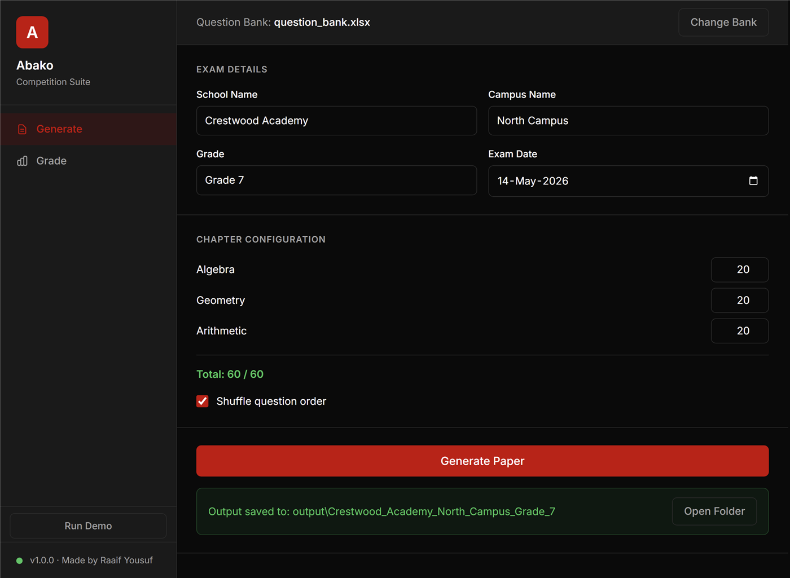
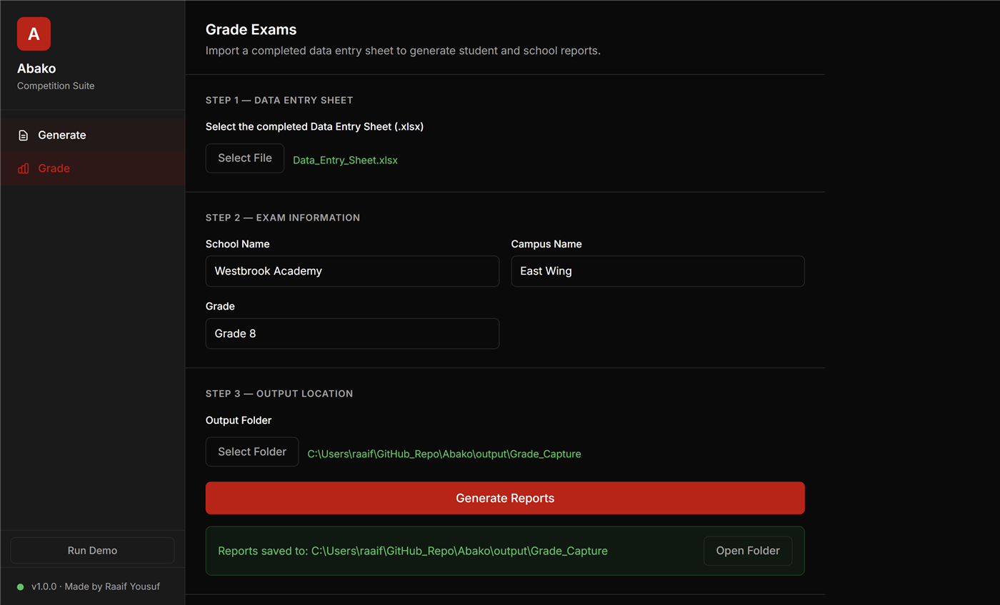

# Abako Competition Suite

I built this for Abako Technologies to run their national math competition.
You give it an Excel question bank; it builds a 60-question exam with a
matching answer key and a data entry sheet, grades the filled sheet, and
prints a report card and a certificate for every student. Setting up one
round used to be an afternoon of copy-paste.



- You pick the chapters and how many questions each one contributes. The
  selector tops up any shortfall from a dedicated Filler sheet, never from a
  chapter nobody picked, and never returns the same question twice.
- Every question column in the entry sheet gets its own dropdown built from
  that question's real answer. The grader accepts only those three values, so
  a typo is impossible rather than merely discouraged.
- Correct is +1, incorrect is -1, unattempted is 0, floored at zero.
  Percentile uses the midrank definition, so students on the same score
  always get the same percentile.
- Electron front end, Python doing the work behind a localhost HTTP server,
  packaged as one portable Windows executable.

Marking is the other half. You hand back the entry sheet the markers filled
in and it writes a report card and a certificate for each student plus one
school summary.



Measured on my laptop against the 75-question sample bank, timing the
backend calls themselves:

| Step | Output | Time |
|---|---|---|
| Build the exam pack | question paper, answer key, entry sheet | 0.1 s |
| Grade and report, 100 students | 101 PDFs | 12.5 s |

```
py -3.12 -m venv .venv && .venv\Scripts\pip install -r requirements-dev.txt
npm install
python tools/make_sample_bank.py
npm start
```

`pytest -q` runs 51 tests covering question selection, percentiles and
ranking, the grader's edge cases, the Flask endpoints and every PDF the app
produces. CI runs them on each pull request.

Samples of the printed output are in [docs/](docs/), and
[docs/architecture.md](docs/architecture.md) is the longer write-up.
