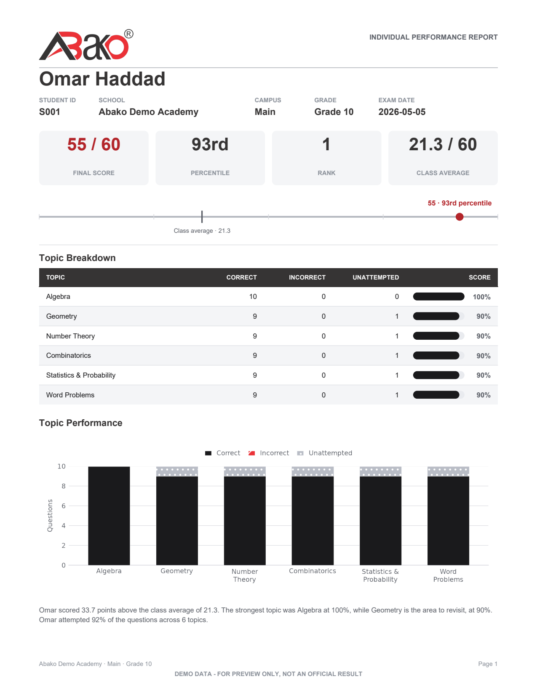

# Abako Competition Suite

I built this for Abako Technologies to run their national math competition. You
give it an Excel question bank; it builds a 60-question exam with a matching
answer key and a data entry sheet, grades the filled sheet, and prints a report
card and a certificate for every student. Setting up one round used to be an
afternoon of copy-paste.



The second page of every student report is a certificate. The question paper
and answer key are in [docs/](docs/).

- **Generate.** You pick the chapters and how many questions each contributes.
  The selector tops up any shortfall from a dedicated Filler sheet, never from
  a chapter nobody picked, and never returns the same question twice.
- **Mark.** Every question column in the entry sheet gets its own dropdown
  built from that question's real answer. The grader accepts only those three
  values, so a typo is impossible rather than merely discouraged.
- **Report.** Correct +1, incorrect -1, unattempted 0, floored at zero.
  Percentile uses the midrank definition, so students on the same score always
  get the same percentile.
- **Ship.** Electron front end, Python doing the work behind a localhost HTTP
  server, packaged as one portable Windows executable.

Measured on my laptop with a 75-question bank, all timings from a cold start:

| Step | Output | Time |
|---|---|---|
| Build the exam pack | question paper, answer key, entry sheet | 0.3 s |
| Whole demo round, 20 students | 23 PDFs plus the entry sheet | 6.6 s |
| Grade and report, 100 students | 101 PDFs | 43 s |

```
py -3.12 -m venv .venv && .venv\Scripts\pip install -r requirements-dev.txt
npm install
python tools/make_sample_bank.py
npm start
```

`pytest -q` runs 49 tests covering question selection, percentiles and ranking,
the grader's edge cases, the Flask endpoints and every PDF the app produces.
CI runs them on each pull request.
